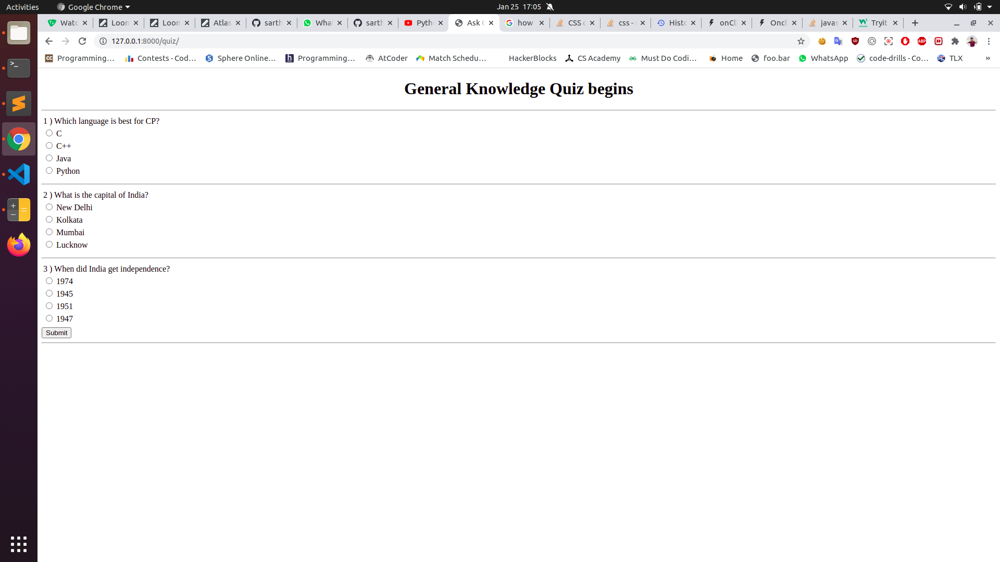

# Ask-Quiz
A quiz application.
This web app is built using Django and sqlite3 database.

# Features
  <li>Admin has the authority to add or remove questions.</li> 
  <li>Score is displayed after quiz gets submitted.</li>
  <li>Correct answers are displayed only after submitting the quiz.</li>

# Installation

### Running locally
Follow given steps :-
    1. Clone or Download the repository.
        <pre>git clone https://github.com/sarthakeddy/Ask-Quiz.git
        cd Ask-Quiz/src</pre>
    2. Create a super user to add or remove questions from database.
        <pre>python3 manage.py createsuperuser</pre>
        Enter your name, email and password.
    3. Start the server
        <pre>python3 manage.py runserver</pre>
        Follow the given link to access website.
    4. Access quiz at http://127.0.0.1:8000/quiz/
    5. Access admin page at http://127.0.0.1:8000/admin 

## Screenshots

## Get in touch

